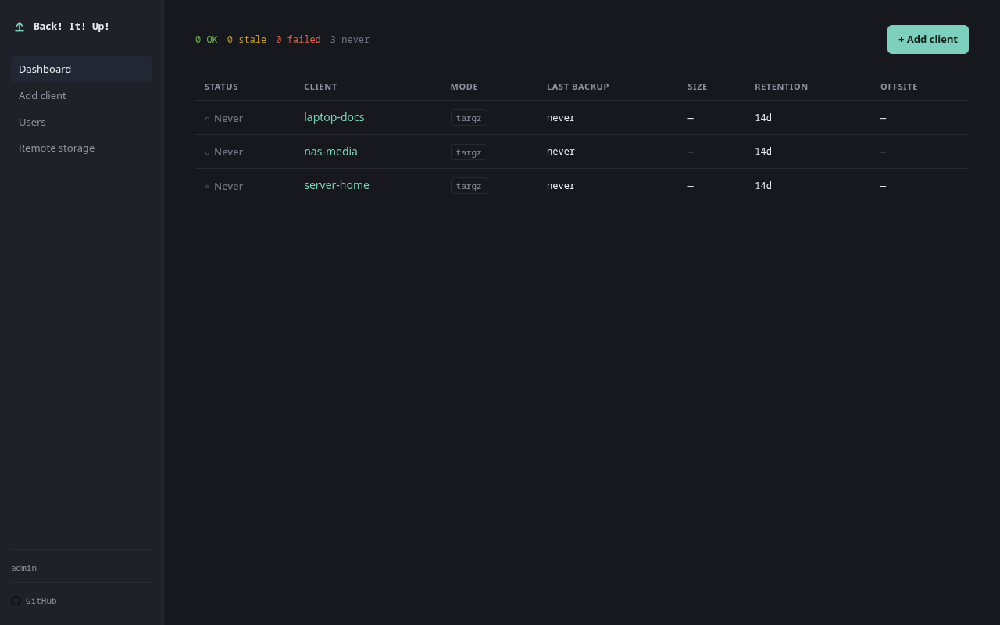
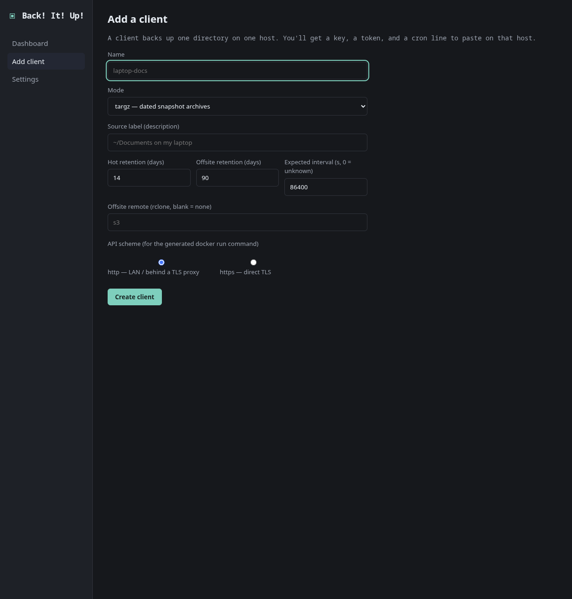
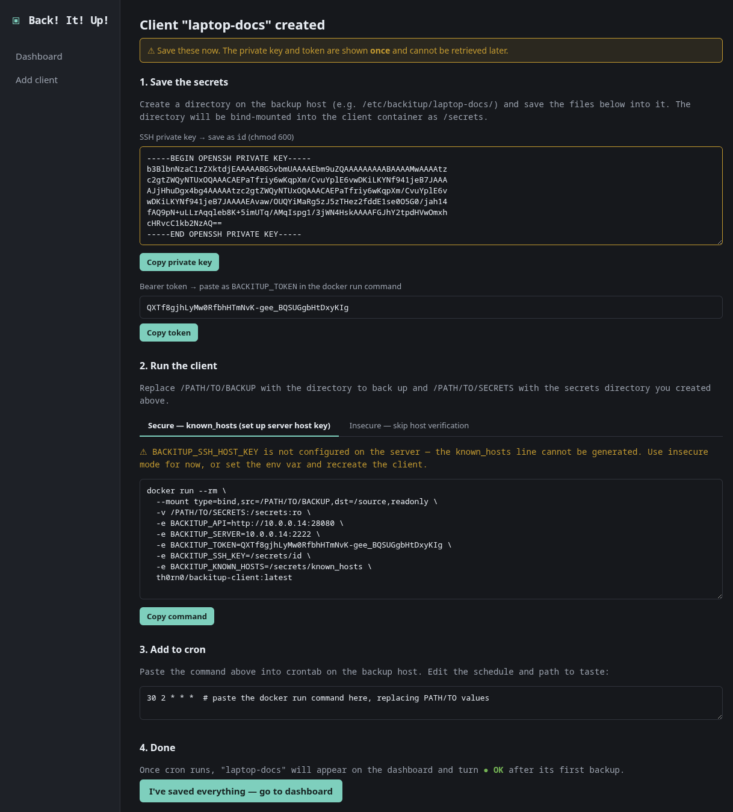
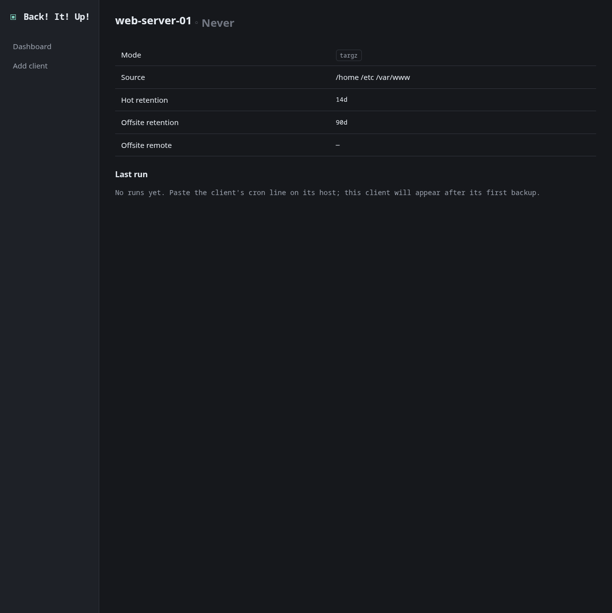
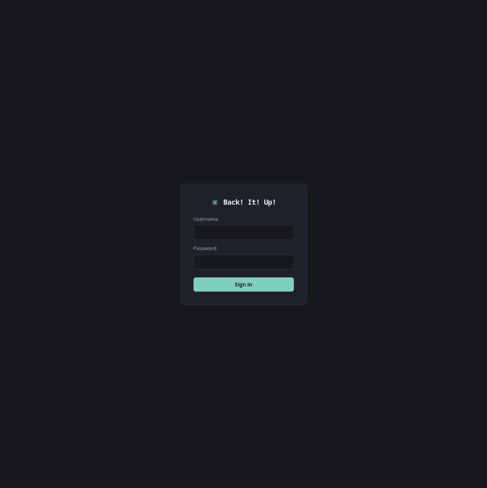
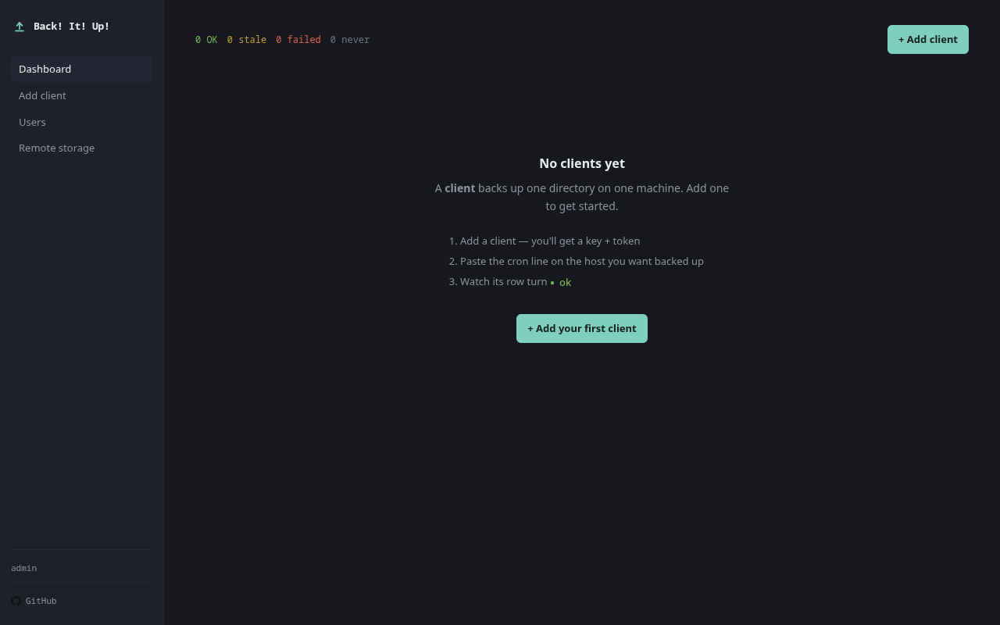

# Back! It! Up!

Self-hosted, centralized **fleet backup** for Linux + macOS. A clean control plane
on top of proven tools (rsync, OpenSSH, rclone): one server, one webgui, many dumb
cron-triggered clients, with hot backups on the server and encrypted offsite tiering
to Google Drive / S3 / 40+ providers.

Add a machine by issuing a key in the webgui, paste one cron line on the host, and
watch the whole fleet's backup health from a single dashboard.

---

## Screenshots

| Dashboard | Add a client |
|-----------|-------------|
|  |  |

| Client created — one-time secrets | Client detail |
|----------------------------------|---------------|
|  |  |

| Login | Empty dashboard |
|-------|----------------|
|  |  |

---

## Table of contents

- [Why](#why)
- [How it works](#how-it-works)
- [Architecture](#architecture)
- [Quick start (Docker Compose)](#quick-start-docker-compose)
- [Building the images](#building-the-images)
- [Running the server with `docker run`](#running-the-server-with-docker-run)
- [Client setup (per host)](#client-setup-per-host)
- [Configuration reference](#configuration-reference)
- [Backup modes](#backup-modes)
- [Retention & offsite](#retention--offsite)
- [Security model](#security-model)
- [Development](#development)
- [Project layout](#project-layout)
- [Roadmap](#roadmap)

---

## Why

restic / Borg / Kopia are excellent backup *engines* with no clean centralized fleet
control. UrBackup has fleet control but a clunky UI and a heavy client. Back! It! Up!
is the clean **control plane**: the server owns all configuration, the client is a dumb
uploader you drop on any host, and one dashboard answers the only question that
matters — *are my backups OK?*

Back! It! Up! deliberately does **not** reinvent the data engine. Transfer is rsync +
OpenSSH, offsite + encryption is rclone, storage is plain files you can browse. The
code we write is the control plane, because that is where the value is.

## How it works

- **The server owns WHAT** — backup mode, excludes, retention, offsite target, keys.
- **The host's cron owns WHEN** — the client is fire-and-forget; you set the schedule
  by editing the host crontab. Changing frequency means editing cron, not the webgui.
- **The client is a dumb, stateless uploader** — triggered by cron, it runs once and
  exits. It reads the source **read-only** and never modifies the host.
- **Each client** has a server-issued SSH key (data channel) + bearer token (control
  channel) and its own confined directory on the server.
- **Hot backups** live on the server; the **lifecycle worker** tiers them to encrypted
  offsite storage and prunes per independent hot/cold retention horizons.

## Architecture

```
        host cron (owns WHEN)
            │ docker run --rm   (source bind-mounted READ-ONLY)
            ▼
   ┌─────────────────┐   SSH (rsync / sftp, per-client key)   ┌──────────────────┐
   │  client (Go)    │ ─────────────────────────────────────▶ │  sshd container  │
   │  dumb uploader  │                                         │  per-client      │
   │                 │ ◀── HTTPS: GET config / POST status ──▶ │  confined dir    │
   └─────────────────┘            (bearer token)               └──────────────────┘
                                                                        │ shared volumes
                                              ┌──────────────────────────▼──────────────┐
                                              │  app container (Go)                      │
                                              │  HTTP API + webgui + lifecycle timer     │
                                              │  SQLite · admin login · authorized_keys  │
                                              │  lifecycle: offsite (rclone+crypt) FIRST,│
                                              │             then prune; integrity verify │
                                              └──────────────────────────────────────────┘
```

Two server containers (design decision: one app process + one sshd). The app is a
single Go binary (API + webgui + lifecycle timer); SQLite is single-writer so one
process avoids cross-process lock coordination.

## Quick start (Docker Compose)

Requirements: Docker + the Compose plugin.

Save this as `docker-compose.yml` (or clone the repo and use the one included):

```yaml
services:
  app:
    image: th0rn0/backitup-server:latest
    restart: unless-stopped
    environment:
      BACKITUP_ADMIN_USER: admin
      BACKITUP_ADMIN_PASSWORD: changeme          # required — set before first start
      BACKITUP_PUBLIC_HOST: your-server:2222     # sshd host:port (BACKITUP_SERVER in docker run)
      BACKITUP_PUBLIC_API: http://your-server:8080  # control-channel URL (BACKITUP_API in docker run)
      BACKITUP_AUTHKEYS: /srv/authkeys/authorized_keys
      BACKITUP_BACKUP_DIR: /srv/backups
      BACKITUP_SSH_HOST_KEY: /srv/hostkeys/ssh_host_ed25519_key.pub
      # BACKITUP_TLS_CERT: /certs/cert.pem      # uncomment for HTTPS
      # BACKITUP_TLS_KEY:  /certs/key.pem
      # BACKITUP_RCLONE_CONFIG: /data/rclone.conf  # needed for offsite tiering
    ports:
      - "127.0.0.1:8080:8080"   # put behind a TLS reverse proxy in production
    volumes:
      - app-data:/data
      - backups:/srv/backups
      - authkeys:/srv/authkeys
      - sshd-hostkeys:/srv/hostkeys:ro
    healthcheck:
      test: ["CMD", "wget", "-qO-", "http://127.0.0.1:8080/healthz"]
      interval: 30s
      timeout: 3s
      retries: 3

  sshd:
    image: th0rn0/backitup-sshd:latest
    restart: unless-stopped
    ports:
      - "2222:2222"             # data channel — clients SSH into this port
    volumes:
      - backups:/srv/backups
      - authkeys:/srv/authkeys:ro
      - sshd-hostkeys:/srv/hostkeys

volumes:
  app-data:       # SQLite database + rclone config
  backups:        # hot backup store (per-client confined dirs)
  authkeys:       # authorized_keys file shared between app and sshd
  sshd-hostkeys:  # sshd host key; app reads the .pub for known_hosts generation
```

Then:

```sh
docker compose up -d
curl http://127.0.0.1:8080/healthz   # -> ok
```

Open `http://127.0.0.1:8080` and sign in with the admin credentials you set above.
Put a TLS reverse proxy in front before exposing it — the login and client tokens must not cross plaintext.

```sh
docker compose down          # stop
docker compose down -v       # stop and DELETE all volumes (destroys backups!)
```

### Named volumes vs bind mounts

The example above uses **Docker named volumes** (`app-data:`, `backups:`, etc.). Named volumes are managed by Docker: it creates them with the right ownership automatically based on the image's built-in `chown`. This is the easiest setup and requires no extra steps.

If you prefer **bind mounts** (host paths) so you control exactly where data lives on disk, you must pre-create the directories and set ownership to uid **10001** — the user both containers run as — before starting the stack. Docker creates missing host directories as root, and the app will silently fail to write `authorized_keys` (leaving SSH connections broken) or fail to open its database.

```sh
# Adjust the base path to wherever you want data to live.
mkdir -p /servdata/backitup/{app-data,backups,authkeys,sshd-hostkeys}
chown -R 10001:10001 /servdata/backitup/app-data \
                     /servdata/backitup/backups \
                     /servdata/backitup/authkeys \
                     /servdata/backitup/sshd-hostkeys
```

Then use host paths in your compose file instead of named volumes:

```yaml
    volumes:
      - /servdata/backitup/app-data:/data
      - /servdata/backitup/backups:/srv/backups
      - /servdata/backitup/authkeys:/srv/authkeys
      - /servdata/backitup/sshd-hostkeys:/srv/hostkeys:ro
```

#### Directory permissions

Both containers run as uid **10001** (`backitup`). Set ownership and permissions before starting the stack:

```sh
chown -R 10001:10001 /servdata/backitup/{app-data,backups,authkeys,sshd-hostkeys}
chmod 755 /servdata/backitup/app-data
chmod 755 /servdata/backitup/backups
chmod 755 /servdata/backitup/authkeys
chmod 700 /servdata/backitup/sshd-hostkeys   # contains the private SSH host key
```

| Directory       | Mode  | Why                                                              |
|-----------------|-------|------------------------------------------------------------------|
| `app-data`      | `755` | SQLite database — only the app writes it                         |
| `backups`       | `755` | Both containers write here; `755` lets you browse from the host  |
| `authkeys`      | `755` | App writes, sshd reads (`:ro`); contains only public keys        |
| `sshd-hostkeys` | `700` | Contains the private SSH host key — no other process needs it    |

> **Symptom if you forget:** the app starts fine and you can create clients, but
> `/srv/authkeys/authorized_keys` is never written, so the sshd container has no
> authorized keys and every client SSH connection fails with
> `no supported methods remain`. Fix: run the `chown` above, then restart the stack
> or rotate any existing client's credentials to trigger a rewrite.

## Building the images

```sh
# Server (control plane): Alpine + rclone, ~145 MB, cgo-free.
docker build -t th0rn0/backitup-server:dev -f Dockerfile .

# Client (dumb uploader): Alpine + rsync + openssh-client, ~25 MB.
docker build -t th0rn0/backitup-client:dev -f Dockerfile.client .

# SSH ingest (data plane): Debian + OpenSSH + rsync/rrsync.
docker build -t th0rn0/backitup-sshd:dev -f Dockerfile.sshd .
```

Both are pure-Go (`CGO_ENABLED=0`) and build for `linux/amd64` and `linux/arm64`:

```sh
docker buildx build --platform linux/amd64,linux/arm64 \
  -t th0rn0/backitup-server:dev -f Dockerfile .
```

## Running the server with `docker run`

```sh
docker run -d --name backitup \
  -p 127.0.0.1:8080:8080 \
  -v backitup-data:/data \
  -v backitup-backups:/srv/backups \
  th0rn0/backitup-server:dev

curl http://127.0.0.1:8080/healthz   # -> ok
```

## Client setup (per host)

The client is **not** a long-running service. The webgui generates the key, token,
and the exact cron line for each client. The shape of that line:

```sh
# Back up /home/me/documents every night at 02:30 (tar.gz mode).
30 2 * * *  docker run --rm \
  --mount type=bind,src=/home/me/documents,dst=/source,readonly \
  -v /etc/backitup/laptop-docs:/secrets:ro \
  -e BACKITUP_SERVER=backup.example.com:2222 \
  -e BACKITUP_TOKEN_FILE=/secrets/token \
  th0rn0/backitup-client:dev
```

Key points:

- `--mount ...,readonly` makes the source physically read-only — the client cannot
  modify the host even in principle.
- Run **multiple clients on one host** by adding more cron lines, each with its own
  source directory and its own secrets.
- The schedule lives here, in cron — Back! It! Up! never changes it for you.

## Configuration reference

### Server (`backitup-server`)

| Variable                   | Default             | Description                                            |
|----------------------------|---------------------|--------------------------------------------------------|
| `BACKITUP_DB`              | `/data/backitup.db` | SQLite database path                                   |
| `BACKITUP_ADDR`            | `:8080`             | HTTP listen address                                    |
| `BACKITUP_ADMIN_USER`      | (unset)             | Admin username; upserts the admin on start when set    |
| `BACKITUP_ADMIN_PASSWORD`  | (unset)             | Admin password (hashed argon2id); set with the user    |
| `BACKITUP_TLS_CERT`        | (unset)             | TLS cert path; serves HTTPS when cert+key are set       |
| `BACKITUP_TLS_KEY`         | (unset)             | TLS key path                                           |
| `BACKITUP_AUTHKEYS`        | `/srv/authkeys/authorized_keys` | Path the app rewrites for the sshd container (D4) |
| `BACKITUP_BACKUP_DIR`      | `/srv/backups`      | Base dir for per-client backup directories             |
| `BACKITUP_PUBLIC_HOST`     | `your-server:2222`  | SSH host:port shown as `BACKITUP_SERVER` in the generated docker run command |
| `BACKITUP_PUBLIC_API`      | (unset)             | Full control-channel base URL shown as `BACKITUP_API` in generated commands (e.g. `http://10.0.0.1:8080`). If unset a placeholder is shown. |
| `BACKITUP_CLIENT_IMAGE`    | `th0rn0/backitup-client:latest` | Client image used in the cron line |
| `BACKITUP_RCLONE_CONFIG`   | `/data/rclone.conf` | rclone config defining the encrypted crypt remote(s)   |
| `BACKITUP_LIFECYCLE_INTERVAL` | `1h`             | How often the lifecycle worker runs (offsite + prune)  |
| `BACKITUP_SSH_HOST_KEY`    | `/srv/hostkeys/ssh_host_ed25519_key.pub` | sshd host public key path; generates `known_hosts` entries in the add-client UI |

### Offsite (cold storage)

Offsite tiering is per-client: set a client's **offsite remote** to an rclone remote
name. Point `BACKITUP_RCLONE_CONFIG` at an `rclone.conf` that defines an encrypted
**crypt** remote wrapping your provider (so the provider only ever sees ciphertext):

```ini
[gdrive]
type = drive
# ... your provider auth ...

[cold]
type = crypt
remote = gdrive:backitup
password = <rclone obscure output>
```

The lifecycle worker (every `BACKITUP_LIFECYCLE_INTERVAL`) tiers each client's new
snapshots to its remote **offsite-first** (never prunes a hot snapshot that isn't
offsited yet), prunes offsite on its own `offsite_retention_days` horizon, prunes the
hot store (never the newest), trims run history, and integrity-checks the latest
snapshot. tar.gz archives upload as-is; rsync snapshots are tar'd into one immutable
object each (no hardlink inflation, no destructive `sync`).

> Set `BACKITUP_ADMIN_USER` + `BACKITUP_ADMIN_PASSWORD` to create the webgui login.
> Set `BACKITUP_TLS_CERT` + `BACKITUP_TLS_KEY` to serve HTTPS (required in production —
> the login and client tokens must not cross plaintext).

### Client (`backitup-client`)

| Variable / flag         | Default       | Description                                              |
|-------------------------|---------------|----------------------------------------------------------|
| `BACKITUP_API`          | (required)    | control-channel base URL, e.g. `https://host:8080`       |
| `BACKITUP_TOKEN`        | (required)    | bearer token for the control channel                     |
| `BACKITUP_SERVER`       | (required)    | sshd ingest `host:port` (data channel)                   |
| `BACKITUP_SSH_KEY`      | `/secrets/id` | path to the client's private key                         |
| `BACKITUP_KNOWN_HOSTS`  | (unset)       | known_hosts file for host-key verification               |
| `BACKITUP_CA`           | (unset)       | CA bundle to trust a self-signed control-channel cert    |
| `BACKITUP_SOURCE`       | `/source`     | read-only source mount inside the container              |
| `BACKITUP_MODE`         | `targz`       | fallback mode; the server's config is authoritative      |
| `BACKITUP_INSECURE`     | (unset)       | set to `1` to skip host-key/TLS verification (dev only)  |

The client takes the per-client key, token, and a copy-paste cron line from the
webgui's "Add client" flow. It fetches its mode/excludes/retention from the server,
runs the backup (reading the source **read-only**), and reports status back. Each run
holds a per-client lock, so an overrun never collides with the next cron tick.

> Production: set `BACKITUP_KNOWN_HOSTS` (and `BACKITUP_CA` if the control channel
> uses a self-signed cert) rather than `BACKITUP_INSECURE=1`.

## Backup modes

Chosen per client in the webgui. They are different architectures, not two settings
of one pipeline:

| Mode    | How                                              | Retention            |
|---------|--------------------------------------------------|----------------------|
| `targz` | Each run uploads a dated `.tar.gz` snapshot archive | Prune old archives |
| `rsync` | `rsync --link-dest` into dated dirs (hardlink snapshots) | Prune old snapshot dirs |

`tar.gz` is simplest and fully self-contained per snapshot. `rsync` gives cheap
incremental snapshots on the hot store via hardlinks (only changed data costs space).

## Retention & offsite

- **Hot retention** (`retention_days`) prunes snapshots on the server.
- **Offsite retention** (`offsite_retention_days`) is **independent** — usually
  longer, because cold storage is your long-horizon copy.
- Offsite uses **rclone** with an encrypted **crypt** remote, so the provider only
  ever sees ciphertext. Adding a provider (Drive, S3, B2, …) is an rclone remote,
  not new code.
- The lifecycle worker runs **offsite first, then prune** — a snapshot is never
  pruned before it is confirmed offsited. Offsite pushes **immutable per-snapshot
  objects** (no destructive sync), so corruption cannot be replicated over your only
  cold copy.

## Security model

- **Non-destructive by design.** The client mounts the source **read-only**, only ever
  reads it, runs as a non-root user with a read-only root filesystem and dropped
  capabilities, and is covered by a test asserting source files are unchanged after a
  run (both modes, including `rsync --delete`).
- **Control channel is HTTPS** with the client verifying the certificate — the login
  password and bearer token never cross plaintext.
- **Offsite is encrypted** before it leaves (rclone crypt). The hot store on your own
  server is plaintext (the server is the trusted party; the offsite provider is not).
- **Webgui is behind an admin login** (argon2id, session cookie). It serves every
  client's data for download and issues keys, so it is never unauthenticated.
- **Per-client SSH access is confined**: `internal-sftp` + chroot for tar.gz clients,
  restricted `rrsync` locked to the client's directory for rsync clients.

## Development

```sh
go test ./...              # run all tests
go test -cover ./...       # with coverage
go build ./...             # build everything
gofmt -l . && go vet ./... # format + vet (both should be silent)

# Run the server locally (no Docker):
BACKITUP_DB=./data/backitup.db BACKITUP_ADDR=:8080 go run ./cmd/server
curl localhost:8080/healthz
```

Internal packages are at 100% statement coverage (`store` at 90% — the remainder is
defensive error branches that require fault injection). `cmd/*` are thin wiring around
the tested `internal/*` packages.

## Project layout

```
cmd/server        control plane entrypoint (wiring only)
cmd/client        dumb uploader entrypoint (wiring only)
internal/model    domain types + dashboard health derivation
internal/store    SQLite persistence (pure-Go driver, cgo-free)
internal/mode     per-mode behaviour seam (rsync / tar.gz), client + server sides
internal/server   HTTP control plane (testable handler construction)
internal/client   client config + validation
Dockerfile         server image (Alpine + rclone)
Dockerfile.client  client image (Alpine + rsync + openssh-client)
docker-compose.yml app + sshd ingest topology
```

## Roadmap

Back! It! Up! is built in lanes (see the design doc). Lane 0 is done.

- [x] **Lane 0** — foundation: model, store, mode seam, server skeleton, Docker, tests
- [x] **Lane B** — webgui: admin login (argon2id + session), fleet dashboard (status
      language, empty state, responsive), `/api/v1/config` + `/api/v1/status`, optional TLS
- [x] **Lane A** — SSH ingest container + per-client key/token issuance, atomic
      `authorized_keys` generation with per-mode forced commands (injection-defended),
      and the add-client flow (verified end-to-end: real SSH tar.gz upload, confined,
      byte-identical roundtrip)
- [x] **Lane C** — client run flow (lockfile, config fetch, status report) + both
      backup modes: tar.gz (pure Go, streamed over SSH) and rsync (hardlink snapshots
      via rrsync). Verified end-to-end through docker compose: both modes upload, the
      dashboard goes green, and rsync produces real incremental hardlinked snapshots
- [x] **Lane D** — lifecycle worker: encrypted offsite via rclone crypt
      (offsite-first, independent retention, immutable per-snapshot objects),
      hot pruning (protect-newest, offsite-first), runs-table trim, and integrity
      verification of the latest snapshot. Verified end-to-end: the worker tiers a
      backup to an encrypted crypt remote (ciphertext on disk, decrypts correctly)
      and the dashboard reflects offsite freshness.

**All lanes complete.** The full path works: client → SSH ingest → hot store →
encrypted offsite, managed from the dashboard.

See `TODOS.md` for deferred work.
